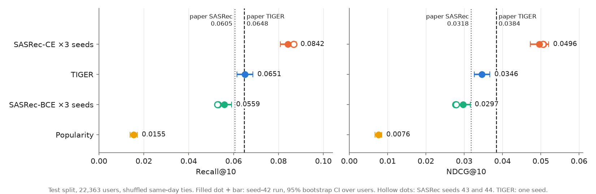
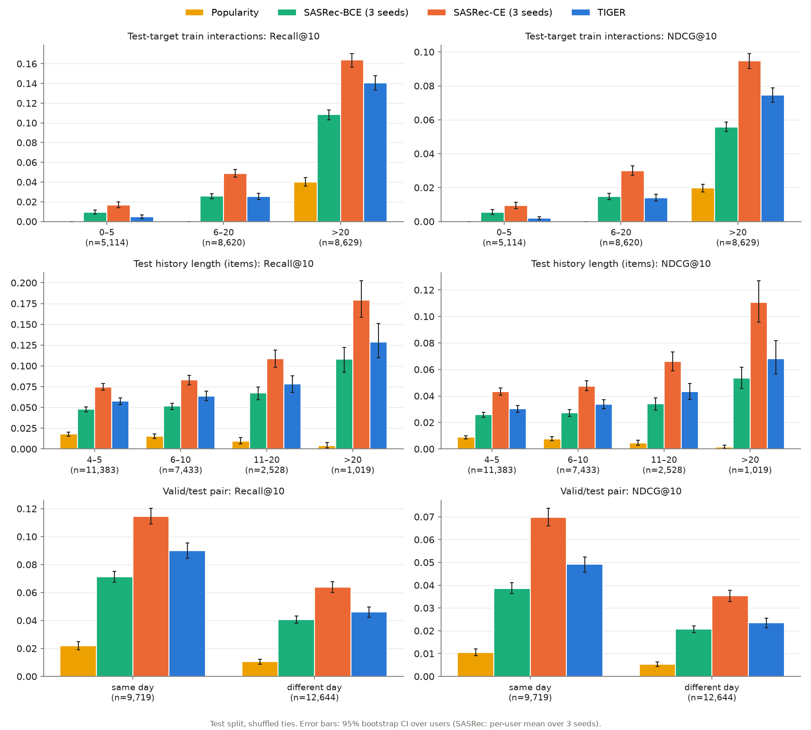
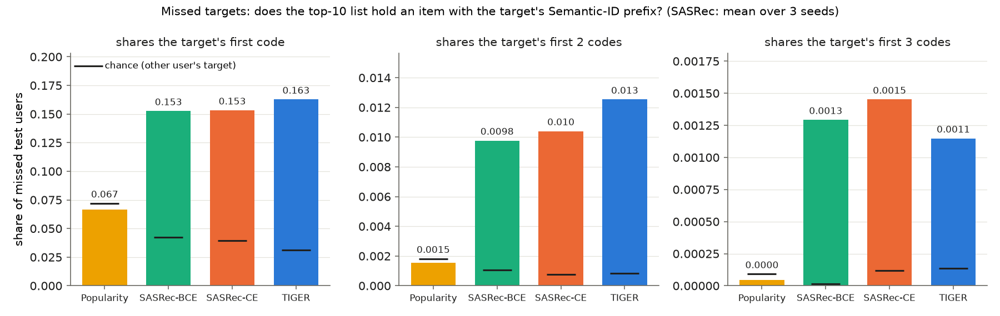
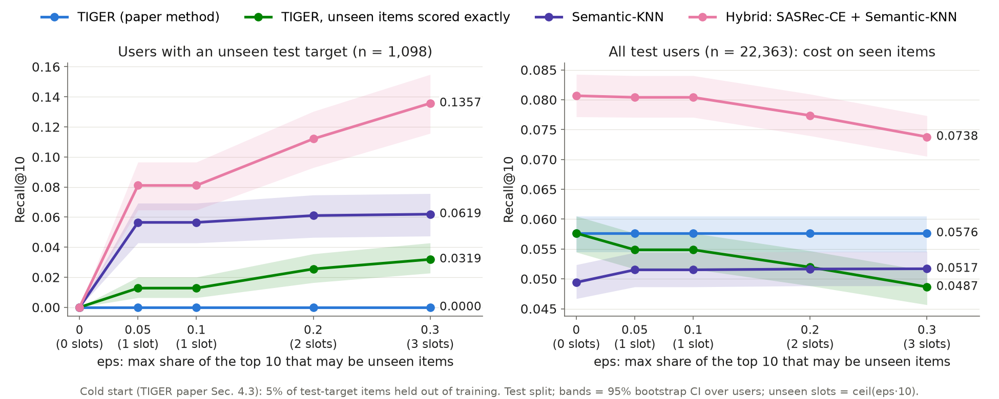
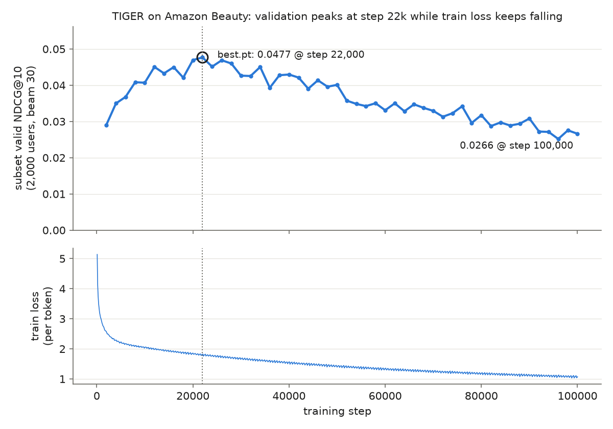
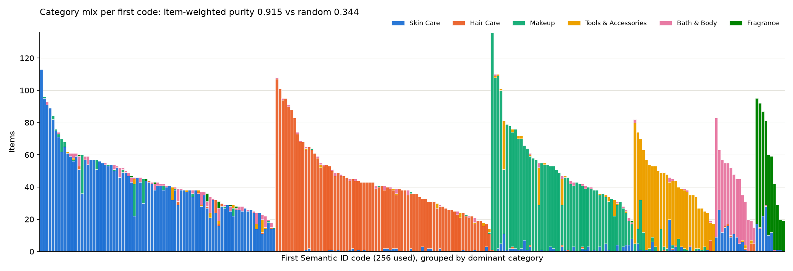

# TIGER, reproduced: generative retrieval with Semantic IDs on Amazon Beauty

**TL;DR**
- **Reproduced:** TIGER matches the paper's Recall@10 (0.0651 vs 0.0648).
- **Beaten by a stronger baseline:** SASRec with a full-softmax loss scores Recall@10 0.0859 ± 0.0015 (3 seeds) vs TIGER's 0.0651.
- **Cold start:** the paper's method retrieves 0 unseen items; a SASRec + Semantic-KNN hybrid reaches Recall@10 0.0811 on those users at almost no cost to everyone else (0.0807 → 0.0804).
- **Debugging:** three silent failures in training and evaluation diagnosed and fixed: RQ-VAE codebook collapse, a decoder that ignored its encoder, and an MPS memory blow-up during evaluation.

I reimplemented **TIGER** (Rajput et al., *Recommender Systems with Generative Retrieval*, NeurIPS 2023) from scratch and evaluated it on Amazon Beauty alongside Popularity and SASRec, all through one evaluation pipeline: full ranking, 95% bootstrap CIs and paired tests over 22,363 users.
Items are encoded as **Semantic IDs** (Sentence-T5 → RQ-VAE, 4 tokens), and a T5-style encoder-decoder generates the next item's ID with trie-constrained beam search.
TIGER matches the paper's Recall@10 and beats SASRec trained as in the paper. It loses to a SASRec trained with full-softmax cross-entropy, is weakest on rare items, and, in the cold-start setup, retrieves none of the unseen items.
I also traced *why* each gap appears; the key findings follow.

- **Reproduction:** TIGER test Recall@10 is **0.0651** (paper 0.0648) and it beats the paper-style SASRec (BCE loss), paired NDCG@10 **+0.0049** [+0.0029, +0.0070]. The same SASRec with a **full-softmax CE loss beats TIGER on every metric** (NDCG@10 −0.0150 [−0.0170, −0.0129]), against all 3 seeds and in every bucket I analysed.
- **Where TIGER wins and loses:** TIGER beats SASRec-BCE on popular items (>20 train interactions: NDCG@10 +0.0188 [+0.0147, +0.0226]) but is the weakest learned model on rare ones (≤5 interactions: Recall@10 0.0047 vs 0.0096 BCE and 0.0167 CE). This is the opposite of the paper's motivation that shared codes help rare items.
- **Cold start:** with 5% of test items held out of training, the paper's method retrieves **0** of them. TIGER generalizes through the *first* code only: it scores unseen items' later codes as very unlikely (log-prob −12.52 vs −0.53 at code 3). A simple SASRec-CE + Sentence-T5 nearest-neighbour hybrid reaches Recall@10 **0.0811** on those users, for an overall cost of 0.0807 → 0.0804.

## Key results

Test split, shuffled same-day ties, 22,363 users, full ranking over 12,101 items. Mean [95% bootstrap CI over users] for single runs; mean ± std over seeds 42/43/44 for SASRec. Source: [`results/summary_test_tieshuffle.md`](results/summary_test_tieshuffle.md).

| Model | Recall@5 | NDCG@5 | Recall@10 | NDCG@10 |
|---|---|---|---|---|
| Popularity | 0.0095 [0.0082, 0.0107] | 0.0057 [0.0049, 0.0065] | 0.0155 [0.0138, 0.0171] | 0.0076 [0.0067, 0.0085] |
| SASRec-BCE (paper-style loss), ×3 seeds | 0.0339 ± 0.0014 | 0.0220 ± 0.0009 | 0.0539 ± 0.0017 | 0.0285 ± 0.0011 |
| SASRec-CE (full softmax), ×3 seeds | **0.0601 ± 0.0010** | **0.0420 ± 0.0003** | **0.0859 ± 0.0015** | **0.0503 ± 0.0006** |
| TIGER (ours, 1 seed) | 0.0414 [0.0386, 0.0441] | 0.0270 [0.0252, 0.0290] | 0.0651 [0.0614, 0.0686] | 0.0346 [0.0326, 0.0367] |
| *Paper: SASRec* | *0.0387* | *0.0249* | *0.0605* | *0.0318* |
| *Paper: TIGER* | *0.0454* | *0.0321* | *0.0648* | *0.0384* |

Paired differences (per user, 1,000 resamples), TIGER minus:

| vs | Recall@10 | NDCG@10 |
|---|---|---|
| Popularity | +0.0496 [+0.0459, +0.0532] | +0.0270 [+0.0249, +0.0293] |
| SASRec-BCE (seed 42; seeds 43/44 larger) | +0.0092 [+0.0054, +0.0128] | +0.0049 [+0.0029, +0.0070] |
| SASRec-CE (seed 42; seeds 43/44 similar) | −0.0190 [−0.0228, −0.0156] | −0.0150 [−0.0170, −0.0129] |

## Findings

### (a) Reproduction: TIGER beats paper-style SASRec, not full-softmax SASRec



- **Close to the paper's numbers.** SASRec-BCE (3-seed mean) is −10.5% to −12.4% below the paper's SASRec across the four metrics, inside the ±15% target set before the runs. TIGER is +0.5% on Recall@10 (the paper's 0.0648 is inside our CI) and −8.9% / −15.8% / −9.8% on Recall@5 / NDCG@5 / NDCG@10, with the paper's values above our CIs.
- **The paper's ranking holds only with the paper's baseline loss.** TIGER beats SASRec-BCE on all four metrics against all three SASRec seeds (all CIs > 0). Switching SASRec to full-softmax cross-entropy (no other change) makes it the strongest model: +42% Recall@10 over the paper's SASRec, and above TIGER on every metric (all CIs < 0, 3/3 seeds).
- A full softmax over 12,101 items is cheap, so whether TIGER "wins" here depends on the baseline's loss, not only on the architecture.

### (b) Where TIGER wins and loses



Buckets: train interactions of the test target, length of the user's history, and whether the valid and test items fall on the same day. Source: [`results/analysis_phase4_test.md`](results/analysis_phase4_test.md).

| Bucket (test-target train interactions) | users | SASRec-BCE ×3 | SASRec-CE ×3 | TIGER | TIGER − SASRec-BCE (NDCG@10) |
|---|---:|---|---|---|---|
| 0–5 | 5,114 | R@10 0.0096 | R@10 0.0167 | R@10 0.0047 | −0.0036 [−0.0050, −0.0022] |
| 6–20 | 8,620 | R@10 0.0256 | R@10 0.0488 | R@10 0.0254 | −0.0006 [−0.0025, +0.0010] |
| >20 | 8,629 | R@10 0.1085 | R@10 0.1639 | R@10 0.1406 | +0.0188 [+0.0147, +0.0226] |

- **TIGER < SASRec-CE in every bucket** (all paired CIs < 0, 3/3 seeds). The largest gap is for users with >20 history items (NDCG@10 −0.0425 [−0.0548, −0.0305]); TIGER reads the last 20 items, SASRec the last 50.
- **TIGER's advantage over SASRec-BCE comes from popular targets.** It is tied with BCE on 6–20-interaction targets and worse on rare ones. No model retrieves any of the 64 test targets that never appear in training.
- **Near misses:** when TIGER misses, its top 10 holds an item with the target's first Semantic-ID code for 16.3% of users, vs 15.3% for both SASRec variants. Paired on users that both models miss: +0.0064 [+0.0018, +0.0110] vs CE. Matching the first two codes is rare for every model (TIGER 1.3%, CE 1.0%), so TIGER's misses are slightly more often "right category, wrong item".

<details><summary>Near-miss figure (Semantic-ID prefixes of missed targets)</summary>



</details>

### (c) Cold start: the paper's method retrieves no unseen items



**Setup (paper Sec. 4.3):** 415 items (5% of distinct test targets, seed 0) are removed from all training data. The RQ-VAE, SASRec-CE and TIGER are retrained without them, and the unseen items get Semantic IDs from the trained RQ-VAE. 1,098 of 22,363 test users have an unseen target. `eps` caps the share of the top-K that may be unseen items (`ceil(eps·K)` slots). Source: [`results/coldstart_test.md`](results/coldstart_test.md).

| Users with an unseen target (n = 1,098), Recall@10 | eps 0.1 (1 slot) | eps 0.3 (3 slots) |
|---|---|---|
| TIGER (paper method: beam search, unseen items by 3-code prefix match) | **0.0000** [0.0000, 0.0000] | 0.0000 |
| TIGER, unseen items scored exactly (our variant) | 0.0128 [0.0064, 0.0200] | 0.0319 |
| Semantic-KNN (cosine to the last item's Sentence-T5 embedding) | 0.0565 [0.0428, 0.0692] | 0.0619 |
| **Hybrid: SASRec-CE + Semantic-KNN for the unseen slots** | **0.0811** [0.0647, 0.0965] | 0.1357 |

**Why it is 0.** The paper's method reaches an unseen item only if TIGER generates an ID that shares its first three codes. But only **3 of the 415** unseen items share a 3-code prefix with any training item (all 415 share the first code), and TIGER's beam never generated an unseen item's full ID. Teacher-forced log-probs of the target's codes show the mechanism (best checkpoint; source: [`results/coldstart_logprob_test.md`](results/coldstart_logprob_test.md)):

| Mean log-prob of target code | code 1 | code 2 | code 3 |
|---|---|---|---|
| unseen targets (1,098 users) | −5.14 | −7.93 | −12.52 |
| seen targets (21,265 users) | −5.24 | −3.94 | −0.53 |

The first code (≈ product category) is predicted as well for unseen items as for seen ones. From the second code on, TIGER has learned *which code combinations exist in training* and gives new combinations almost no probability. Matching unseen items on fewer codes (an evaluation-only sensitivity, left out of the figure) helps little. Matching the first 2 codes gives Recall@10 0.0091 at eps 0.1 (0.0137 at eps 0.3). Matching the first code alone gives 0.0191 (0.0847 at eps 0.3), but lowers all-user NDCG@10 from 0.0316 to 0.0278 (0.0250 at eps 0.3). The Recall@K curves and all variants are in the source table. The hybrid costs almost nothing for everyone else: all-user Recall@10 is 0.0807 at eps 0 and 0.0804 at eps 0.1.

### (d) TIGER overfits after step 22k



- Validation NDCG@10 (fixed 2,000-user subset, beam 30) peaks at **0.0477 at step 22k**, then falls to 0.0266 at step 100k.
- Over the same span, train loss keeps falling (2.57 at 2k → 1.82 at 22k → 1.07 at 100k).
- I stopped the run by hand at 100k of the paper's 200k steps. Every test number uses the step-22k checkpoint, evaluated once.
- The 2,000-user subset was optimistic: the full validation set gives NDCG@10 0.0426 at that checkpoint.

## Debugging stories

The numbers in this section come from diagnostics recorded in the project log ([`STATUS.md`](STATUS.md)), not from scripts in this repo, except where a saved run is named.

- **The RQ-VAE collapses under the paper's settings.** With Adagrad lr 0.4 every item mapped to a single code after one epoch. In 150–300-epoch diagnostics, every optimizer tried on the raw unit-norm Sentence-T5 vectors settled at the loss of predicting the mean embedding. The fix:
  - standardize each input dimension;
  - use AdamW lr 1e-3;
  - reset dead codes every 10 epochs until epoch 2,000, then train ≥1,000 epochs without resets (final codes come from this phase).

  Result: codebook usage 100% at all 3 levels, 11,816 unique 3-code prefixes for 12,101 items, and first-code category purity 0.915 vs 0.344 for random codes (figure under Method). The paper settings remain runnable: `configs/rqvae_paper.yaml`.
- **TIGER's decoder ignored the encoder.** The first long run sat at Popularity level: subset valid NDCG@10 0.0051–0.0084 from step 2k to 20k (saved in `results/tiger_tieshuffle_collapsed_adafactor_noscale`) while train loss fell. Diagnosis:
  - Top-10 lists for 2,000 users held only 15 distinct items, and swapping in another user's history left them unchanged.
  - Pooled encoder outputs had cosine 0.999 between users, and zeroing the encoder changed the first-code distribution by KL 0.0003.
  - The first code was predicted worse than a first-code bigram table, so loss fell only through codes 2–4, which follow from the prefix.
  - Ruled out: input layout, target IDs, label shift, ID maps, trie, cross-attention wiring, beam search (which matched exact full scoring).

  Cause: Adafactor with `scale_parameter=False` at lr 0.01, which makes each update about the size of the whole init std of the attention weights. With the T5 default `scale_parameter=True`, a 2,000-step probe passed every check fixed before the run: 519 distinct items in the top-10 lists, zero-encoder KL 0.837, subset NDCG@10 0.0298 vs Popularity's 0.0087.
- **Evals slowed 15× on MPS.** Subset evals went from 30 s to 461 s. One beam-search batch (256 users × 30 beams) peaked at ~20.6 GB of MPS memory, which stayed cached and pushed a 32 GB Mac into swap. Two fixes:
  - `use_cache=False` in the beam-search decoder calls: HF T5 otherwise returns cross-attention K/V for every beam. Peak 20.6 → 5.0 GB, identical outputs.
  - `torch.mps.empty_cache()` after each eval batch.

  With the cache release alone, evals were back to 25–32 s and training kept its 2.1 steps/s. In the final run (both fixes), a subset eval took 13.5 s.

## Method

**Data.** Amazon Product Reviews 2014, Beauty 5-core (McAuley): 22,363 users, 12,101 items, 198,502 interactions, mean sequence length 8.876 (median 6), matching the paper's statistics.
- Item IDs are assigned in ASIN order, not order of first appearance, to avoid the sequential-ID leakage noted in the TIGER appendix.
- **Same-day ties:** timestamps have day resolution, and the raw file is sorted by ASIN, so keeping file order would put same-day items in ASIN order. In that order the test item has the higher ID on all 9,719 same-day valid/test pairs. The main dataset therefore shuffles same-timestamp reviews per user with a fixed seed, which changes the test item for 6,554 users. Original-order runs are kept only as a sensitivity check ([`results/summary_test.md`](results/summary_test.md)).
- I chose to switch to shuffled ties *after* seeing test numbers. The reason is sound, but the switch lowered SASRec-CE (Recall@10 −0.0056, paired), and SASRec-CE is the baseline TIGER is compared against.

**Protocol (all models).**
- Leave-one-out split: the last item is test, the second-to-last is validation, the rest is train.
- **Full ranking** over all items, with no negative sampling. Items in the user's input history are **masked**, and ties are broken by item ID.
- Recall@K = HitRate@K (one target per user), plus NDCG@K.
- 95% percentile bootstrap CIs over users (1,000 resamples). Paired bootstrap for model differences; per-user metric arrays are saved for every run.
- Model selection uses validation only; test is evaluated once per final config. Popularity counts train positions only.

**Semantic IDs.**
- Item text: title, price, brand and categories as one sentence, embedded with `sentence-t5-base` (768-d).
- RQ-VAE: 768→512→256→128→32 with 3 levels × 256 codes (β 0.25), plus a 4th token that separates colliding items (2.36% of items need it).
- The first code tracks product category: item-weighted purity 0.915 vs 0.344 for random codes of the same sizes.



**TIGER.**
- T5 encoder-decoder (HF `transformers`): 4+4 layers, 6 heads × 64, d_model 128, FFN 1024, dropout 0.1; 4.85M parameters.
- Input: one hashed user-ID token (2,000 buckets), then the last 20 items as 4 code tokens each (vocab 3,026).
- Training: Adafactor (`scale_parameter=True`), lr 0.01 constant for 10k steps then inverse-sqrt, batch 256.
- Decoding: trie-constrained beam search (beam 30) over valid IDs; history items are dropped, then the top 10 are kept.

**SASRec.** 2 blocks, hidden 64, 1 head, dropout 0.2, max length 50. Two losses: **BCE** with one sampled negative per position (original SASRec, as in the paper's baseline) and **CE** (full softmax over all items).

## Deviations from the paper and limitations

**Deviations**
1. RQ-VAE input standardized per dimension; the raw embeddings collapse.
2. RQ-VAE trained with AdamW lr 1e-3 instead of Adagrad lr 0.4; every Adagrad setting tried collapsed.
3. Dead-code reset during RQ-VAE training (see Debugging stories).
4. RQ-VAE stops on a plateau at 3,000 epochs instead of 20k.
5. Main TIGER run stopped at step ~100k of 200k (overfitting). Checkpoint chosen by NDCG@10 on a fixed 2,000-user valid subset; the paper does not say how it selects checkpoints.
6. Cold-start TIGER trained for 30k steps, set from the main run's best step (22k). Its RQ-VAE is trained on seen items only, and validation excludes the 913 users with an unseen valid target.

Choices the paper leaves open: Adafactor parameter scaling, the shuffled-tie dataset, collision-token order, and SASRec-CE (not in the paper).

**Limitations**
- **One TIGER seed** (main and cold start). The SASRec variants have 3 seeds each.
- **Shorter TIGER training** than the paper: 100k (main) and 30k (cold start) of 200k steps. The cold-start best checkpoint is at 28k of 30k, so that model may still have been improving.
- **Buckets were chosen after the test split had been evaluated**, and the many bucket comparisons have no multiple-comparison correction.
- The cold-start "exact-scored" TIGER variant and the 2-/1-code matching are my additions, not the paper's method.
- With the paper's stated sizes, my TIGER has 4.85M parameters; the paper reports ~13M. Not reconciled.
- SASRec training on MPS is not bit-for-bit deterministic; seed variation covers that noise.

## Reproduce

Apple Silicon (MPS) or CPU, Python 3.11.

```bash
conda create -n recsys python=3.11 && conda activate recsys
pip install -r requirements.txt && pip install -e .
python -m pytest -q          # 65 tests
bash scripts/reproduce.sh    # every run, table and README figure
```

`scripts/reproduce.sh` covers, in order:
- download and preprocessing (both tie orders);
- Popularity, and SASRec-BCE / SASRec-CE × 3 seeds;
- embeddings → RQ-VAE → Semantic IDs;
- TIGER (~14 h on MPS);
- the bucket / prefix analysis;
- the cold-start split and retraining (TIGER ~4 h), its evaluation and the log-prob diagnosis;
- the summary tables and the figures in `docs/assets/`.

Every run is driven by a YAML file in `configs/` and writes `results/<run>/` with the config, `metrics.json` (seed, git hash, data SHA-256) and per-user `.npy` arrays. Run outputs are gitignored. The summary tables in `results/*.md` and the figures are committed.

```
configs/        YAML per run
src/recsys/     data/ (preprocessing, Semantic IDs, cold-start split), eval/ (metrics, bootstrap, analysis),
                models/ (popularity, sasrec, rqvae, tiger), train/ (trainers), plotting.py
scripts/        CLI entry points (train_*, eval_coldstart, analyze_phase4, compare_runs, plots, reproduce.sh)
results/        summary tables (*.md); run outputs gitignored
docs/assets/    README figures
```
